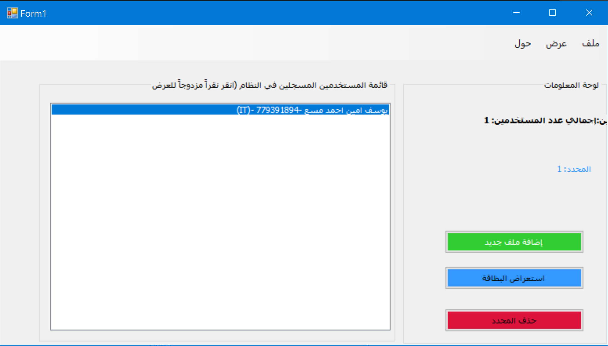
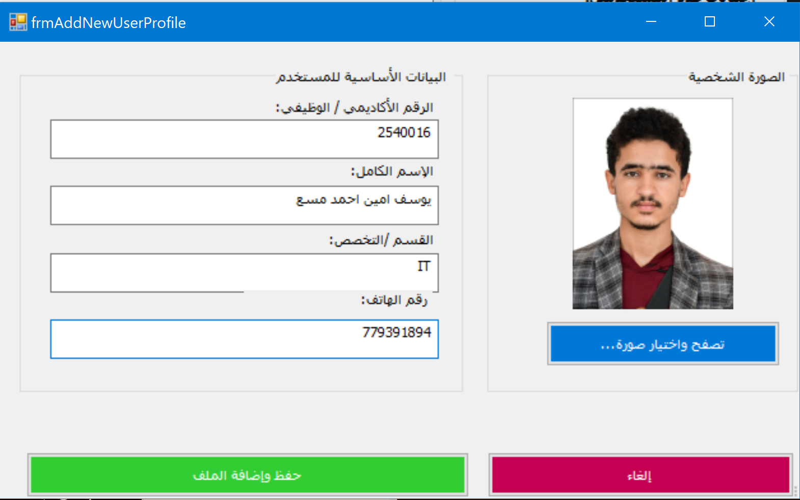
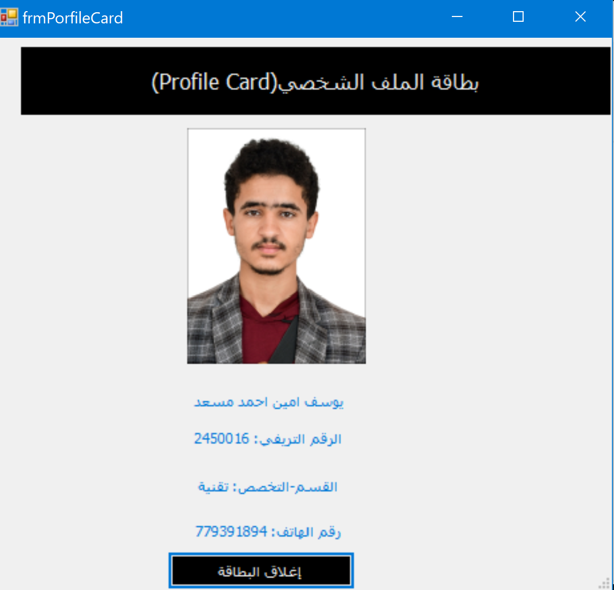

# User Profile Management System

A desktop-based **User Profile Management System** developed in **C#** using **Windows Forms**, designed to manage, display, and organize user and employee profiles through an intuitive graphical interface.

Developed by **Yousif Aljaberi**

---

## Table of Contents

* [Overview](#overview)
* [Screenshots](#screenshots)
* [Features](#features)
* [Technologies](#technologies)
* [Project Structure](#project-structure)
* [User Profile Model](#user-profile-model)
* [Keyboard Shortcuts](#keyboard-shortcuts)
* [Requirements](#requirements)
* [Getting Started](#getting-started)
* [Technical Highlights](#technical-highlights)
* [Future Improvements](#future-improvements)
* [Author](#author)

---

## Overview

This application provides a practical desktop solution for handling basic personnel records, including identifiers, personal details, contact information, and avatar images.

The system enables users to dynamically register profiles, preview standalone identity cards, track total registered entries via real-time counters, and manage records directly through a responsive Windows Forms interface.

---

## Screenshots

| Main Dashboard | Add New Profile |
| :---: | :---: |
|  |  |

| Profile Identity Card |
| :---: |
|  |

---

## Features

### Profile Operations
* **Profile Registration:** Add new users with unique ID, Full Name, Department/Specialization, and Phone Number.
* **Avatar Upload:** Attach custom profile photos from the local file system (`.jpg`, `.png`).
* **Input Validation:** Guard clauses and message prompts to prevent incomplete or missing fields.
* **Profile Removal:** Delete selected profiles directly from the active registry list.

### Visualization & Display
* **Formatted Directory:** Organized list view displaying user credentials using structured text formatting.
* **Identity Badge Preview:** Dedicated modal card showcasing the user's data alongside their photo.
* **Quick-Access Actions:** Double-click any listed profile to instantly launch their identity card.
* **Dynamic Status Counters:** Real-time counters displaying the total number of users and currently selected records.

### Navigation & Accessibility
* Standard Windows MenuStrip layout with categorized dropdown actions.
* Keyboard accelerators for rapid task execution without using the mouse.

---

## Technologies

| Technology | Purpose |
| :--- | :--- |
| **C#** | Primary programming language |
| **Windows Forms (WinForms)** | Graphical user interface framework |
| **.NET Framework / .NET Desktop** | Application runtime and base libraries |
| **Visual Studio** | Integrated Development Environment (IDE) |

---

## Project Structure

```text
Users-Profile-Management-System/
│
├── Form1.cs                    # Main dashboard form (list management, counters, menus)
├── frmAddNewUserProfile.cs     # Input dialog for capturing user data and photo loading
├── frmPorfileCard.cs           # Read-only ID card presentation window
├── UserProfile.cs              # Entity class modeling user attributes and string formatting
├── Screenshots/                # Application screenshots and demo assets
│   ├── main.png
│   ├── Add.png
│   └── Card.png
└── README.md                   # Project documentation

```

---

## User Profile Model

The domain entity encapsulates the following schema:

| Property | Data Type | Description |
| --- | --- | --- |
| `ID` | `string` | Unique identifier / Student or Employee ID |
| `FullName` | `string` | Full name of the user |
| `Deparment` | `string` | Department, branch, or field of specialization |
| `PhoneNumber` | `string` | Contact phone number |
| `image` | `System.Drawing.Image` | Profile avatar loaded from the file system |

---

## Keyboard Shortcuts

| Shortcut | Action | Menu Category |
| --- | --- | --- |
| `Ctrl + N` | Add New User Profile | File (`ملف`) |
| `Ctrl + P` | Preview Profile Card | View (`عرض`) |

---

## Requirements

* Windows 10 or Windows 11
* Visual Studio 2019 / 2022 (with *.NET Desktop Development* workload installed)
* .NET Framework 4.7.2+ or .NET 6.0/8.0 Windows Desktop SDK

---

## Getting Started

1. **Clone the repository:**
```bash
git clone [https://github.com/Yousef-Aljaberi/Users-Profile-Management-System.git](https://github.com/Yousef-Aljaberi/Users-Profile-Management-System.git)

```


2. **Open the Project:**
Launch Visual Studio and open the solution file (`.sln`).
3. **Build the Solution:**
Press `Ctrl + Shift + B` to restore packages and build the project.
4. **Run the Application:**
Press `F5` to start debugging or `Ctrl + F5` to run without debugging.

---

## Technical Highlights

This project demonstrates practical competence in:

* Graphical User Interface (GUI) design using Windows Forms
* Event-Driven Programming in C#
* Object-Oriented Modeling (Encapsulation, Class separation, Overriding `ToString()`)
* Modal and Modeless Dialogs (`ShowDialog()`, `DialogResult`)
* In-Memory Collection Management using generic `List<T>`
* Working with Graphic Resources (`System.Drawing.Image`, `PictureBox`, File Dialogs)
* Form-to-Form Data Passing and State Communication
* Data Validation and Error Guarding

---

## Future Improvements

* Integrate persistent storage using a local database (e.g., SQLite) or serialization (`JSON` / `XML`).
* Store image paths as strings instead of keeping bitmap objects in memory to reduce memory usage.
* Add search and filter options for faster record retrieval.

---

## Author

**Yousif Aljaberi**

* **GitHub:** [Yousef-Aljaberi](https://github.com/Yousef-Aljaberi)
* **LinkedIn:** [Yousif Aljaberi](https://www.linkedin.com/in/yousif-aljaberi-004278408/)

```

```
